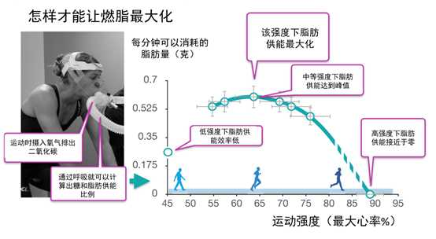
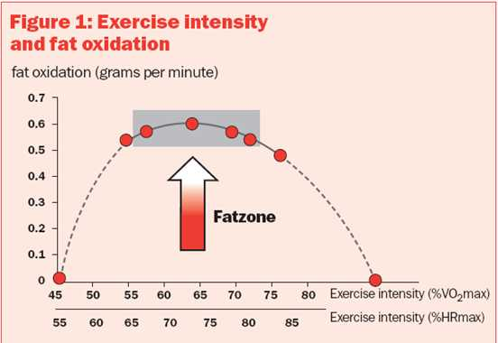
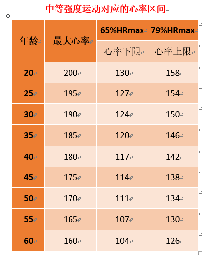
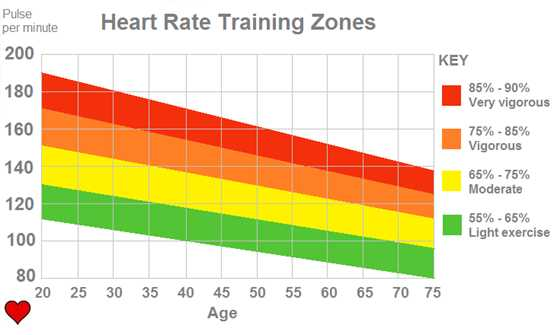
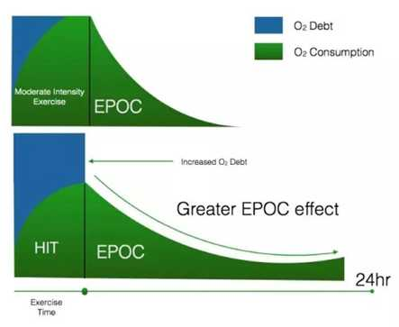
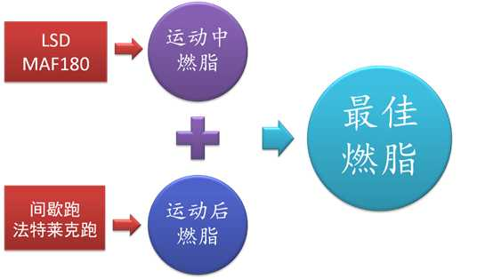

# 跑步

## 最佳燃脂跑法
	
	脂肪供能最大化，通过心率计算出，我们控制心率在多少区间可以实现脂肪供能的最大化。

	

**中等强度慢跑才能实现燃脂效益最大化**

最佳区间：65%-79% 到达79%脂肪供能比下降   191*0.65  -  191*0.79 = 124 - 150.89
灰色区域：65%-73% 脂肪供能比率最大。	 124 - 140 

最大心率：220 - 年龄 220-29 = 191

**结论**

最大心率：191
最佳燃脂心率：124-150 区间

## 跑步方法

### LSD训练(长距离慢跑)
	

	长时间，中等强度，符合上面的最佳燃脂跑法

最长：150分钟。
建议:40-60分钟 尽可能40分钟以上。
心率:65%-79%

#### 时间和强度

 	1. 降低运动强度，延长运动时间。

### MAF180

MAF(Max Aerobic Function Heart Rate) 最大有氧心率训练

目标心率：180-年龄作为跑步时的目标心率。  180-30 = 150  ，初次跑步时建议的目标心率。 

目标时间：40-60分钟

### 燃脂-运动中Or运动后

运动后过量氧耗(Excess Posteercise oxygen consumption,EPOC)

	运动除了本身会引起摄氧量增加外，在运动停止后，机体的摄氧量也不会安静，运动后恢复期摄氧量的现象我们称为运动后过量氧耗。

	持续24-48小时

#### 如何实现
	
	高强度运动，可以持续一定时间。   
	间歇跑，跑一段休息一段，反复重复

最大心率：88%-100%
时间：每组1-3分钟
规律：跑和休的时间比例1：1 
次数：3-5组，
名称：变速跑，法特莱克跑

### 最佳燃脂跑法
	
	LSD或者MAF180训练后，进行2-3组间歇跑

对比：

|名称|效果|最低心率|最高心率|简介

- LSD MAF180 
	适合初级跑者
	适合体内较差的跑者
- LSD MAF180 + 间歇跑 法特莱克跑
	适合经过初级阶段的跑者
	适合体能较好的跑者
	

