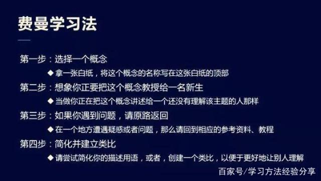
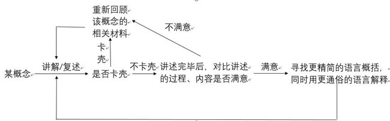
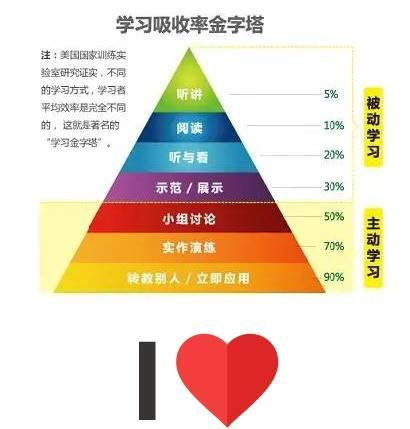

# 学习方法
	
	工欲善其事，必先利其器。

## 费曼学习法 Feynman Technique

**步骤**

1. 获取某个知识/某概念，并且去理解这些内容
2. 按照教程自己来讲解/复述你获得的主要内容
3. 用自己的方式再次复述一下所学到的知识。
4. 循环
- 不满意-纠错反馈
- 满意-尝试运用更简练的语言概括
5. 反思。 反思你在思考的时候在哪里卡壳，着重这个地方，再次理解。重要
6. 校验，通过不断的进行实践才能巩固你对于该知识点的理解。

费曼学习可以考量自己对一个概念或知识是否理解，一个最直观的方法就是讲给别人听，如果能够用简洁清晰的语言让别人完全听懂你在说什么，就证明你完全了解所学的概念；反之则还需要再认真学习。

这种方法在学习理论性，概念性较强的知识是非常实用的。学习一个新的概念知识，并且充分理解它，然后再用自己的语言，自己的方式去复述它，而不是仅仅死记硬背。这样获得的知识才能真正内在化，进入你的大脑。

** 学习吸收率金字塔 **

